<div align="center">

# 🛣️ Road Hazard & Traffic Object Detection 🚦
### *Advanced Real-Time Computer Vision Pipeline*

[]()
[]()
[]()
[]()
[]()

**A unified, production-ready computer vision pipeline designed for simultaneous detection of traffic participants and structural road damage, powered by dynamic Risk Assessment Logic.**

</div>

<br />

## 📖 Table of Contents
1. [Overview & Supported Classes](#-overview--supported-classes)
2. [Neural Architecture & Performance Stack](#-neural-architecture--performance-stack)
3. [The Three-Tier Pipeline Architecture](#-the-three-tier-pipeline-architecture)
   - [Tier 1: Data Synthesis Pipeline](#1-tier-1-data-synthesis-pipeline)
   - [Tier 2: Model Training Pipeline](#2-tier-2-model-training-pipeline)
   - [Tier 3: Risk Assessment Pipeline](#3-tier-3-risk-assessment-pipeline)
4. [Dynamic Risk Classification Logic](#-dynamic-risk-classification-logic)
5. [Real-World Testing & Evaluation Results](#-real-world-testing--evaluation-results)
6. [Repository Layout](#-repository-layout)
7. [Environment Setup](#-environment-setup)

---

## 🌟 Overview & Supported Classes

This repository constructs a state-of-the-art detector using mixed data sources—combining **BDD100K-style traffic data** with **RDD-style road damage data**. Through meticulous annotation conversion, dataset stratification, and class balancing, this system trains **YOLOv8** to achieve robust real-time detection across 9 highly localized categories.

### 🎯 9 Target Categories
| Entity Type | Classes |
| :--- | :--- |
| **Traffic Actors** | 🧍 `pedestrian`, 🚗 `car`, 🚚 `truck`, 🚌 `bus`, 🏍️ `motor` |
| **Road Hazards** | 🚧 `longitudinal_crack`, 🚧 `transverse_crack`, 🚧 `alligator_crack`, 🕳️ `pothole` |

---

## 🏗️ Neural Architecture & Performance Stack

The backbone utilizes the **Ultralytics YOLOv8** family. Specifically optimized on Apple Silicon computations (M4 chips).

### 🧠 Profile (YOLOv8s.pt Checkpoint)
- **Architecture Depth:** 73 layers
- **Parameters:** ~11.13 Million 
- **Compute Load:** 28.5 GFLOPs
- **File Size:** ~22.5 MB

### 📚 Tech Stack
- 🚀 **Ultralytics**: Core model instantiation, loss functions, and spatial validation.
- 🔥 **PyTorch**: Custom `Dataset` interfaces and `DataLoader` pipeline wrappers.
- 🖼️ **OpenCV & Pillow**: High-throughput matrix operations for inference projection (approx `40-50ms` runtime).
- 📊 **Matplotlib**: Statistical chart accumulation and distribution visualizations.

---

## 🗺️ The Three-Tier Pipeline Architecture

We divided the underlying workflows into strictly separated functional pipelines.

### 1. Tier 1: Data Synthesis Pipeline
Creating a balanced dataset from disparate, unstructured data sources is crucial for preventing bias toward overrepresented classes (like `car` which houses >10k instances natively).

**Image Synthesis Analysis (BDD vs. RDD)**
To construct this resilient detector, raw images are extracted and restricted to a max capacity of **6,000 images per source** to avoid overwhelming class imbalances from the start.

- **BDD100K Extraction (`filter_bdd.py`):** Harvests diverse weather & lighting traffic driving conditions. It targets instances explicitly populated by *traffic actors* (`person`, `car`, `truck`, `bus`), gracefully normalizing `bike` into `motor` objects dynamically.
- **RDD Extraction (`filter_rdd.py`):** Acts as the pavement foundation, sweeping global road conditions to isolate *structural hazards* corresponding strictly to our 4 hazard classes (`longitudinal_crack`, `transverse_crack`, `alligator_crack`, `pothole`).

> **🌍 Global Dataset Demographics:** The RDD synthesis intelligently pulls from a diverse geography yielding globally robust models. It encapsulates instances spanning:
> - **India (~35%)**
> - **Japan (~30%)**
> - **Norway & Czech Republic (~20%)**
> - **United States (~15%)**

```mermaid
graph TD
    A([📸 Raw BDD & RDD Images])
    
    subgraph Data Extraction & Formatting
    B[filter_bdd.py & filter_rdd.py]
    C[convert_coco.py]
    D[src/split_dataset.py]
    end
    
    subgraph YOLO Adaptation & Balancing
    E[src/convert_to_yolo.py]
    F[src/select_balanced_4000.py]
    G[src/boost_weak_classes.py]
    end
    
    A -->|Extract Target Classes| B
    B -->|Collate Labels| C
    C -->|Output: annotations.json| D
    D -->|Partition Train/Val/Test| E
    E -->|Convert to .txt standard| F
    F -->|Mitigate class imbalance| G
    G -->|Output: yolo_balanced/| H([🎯 Fully Balanced Training Set])

    style A fill:#1e1e1e,stroke:#333
    style H fill:#003d15,stroke:#0f0
```


### 2. Tier 2: Model Training Pipeline
The training pipeline utilizes Stochastic Gradient Descent (SGD) passing 416x416 representations through backpropagation grids.

```mermaid
graph LR
    A([🎯 yolo_balanced/ Target Data]) -.-> B[(data/yolo.yaml)]
    
    subgraph YOLOv8 Training Engine
    B -.->|Map paths & classes| C{Ultralytics Init}
    C -->|Baseline weights| D[yolov8s.pt Backbone]
    D -->|Batch Size: 8 <br/> Img: 416| E((Epoch Engine <br/> SGD Optimizer))
    E -->|Backpropagation| E
    end
    
    subgraph Validation Output
    E -->|Calculate Spatial Match| F[mAP, Precision, Recall]
    F -->|Checkpointing| G([🧠 best.pt Weights])
    end

    style A fill:#003d15,stroke:#0f0
    style G fill:#4a148c,stroke:#a0f
```



### 3. Tier 3: Inference & Risk Assessment Pipeline
Located primarily within `test.py`, this layer wraps over standard prediction bounds, fetching testing images from URL streams or cameras to calculate spatial risk thresholds.

```mermaid
graph TD
    A([🌐 Live Camera / Image URLs]) -.-> B{test.py Inference Engine}
    
    subgraph Compute Edge
    B -->|Preprocess OpenCV| C[YOLOv8 best.pt]
    C -->|Fetch Tensor Box| D{Positional Logic Matrix}
    end
    
    subgraph Risk Arbitrator
    D -->|Object height <br/> Y > H * 0.6| E{Hazard Logic}
    D -->|Object On Sidewalk| F[✅ LOW RISK]
    
    E -->|Is Object a Vehicle?| G[⚠️ MEDIUM RISK]
    E -->|Is Damage/Pedestrian?| H[🚨 HIGH RISK]
    end
    
    H -.-> I[Render Colored Bounding Boxes]
    G -.-> I
    F -.-> I
    
    I --> J([📊 Distribution Summary + Visual Outputs])
    
    style A fill:#4a148c,stroke:#a0f
    style H fill:#8b0000,stroke:#f00
    style J fill:#003d15,stroke:#0f0
```



---

## 🚦 Dynamic Risk Classification Logic

One of the platform's most advanced features is the automated contextual **Risk Classifier**. We don't just ask *"What is this object?"*; we ask *"Is this object in the road, and does it pose an immediate threat to the vehicle?"*

**How Spatial Risk is identified:**
1. **Geometric Road Threshold:** The algorithm evaluates spatial height. If an object's bounding box spans across the bottom 40% of the camera frame (`Y-center > height * 0.6`), it is flagged as `is_on_road = True`.
2. **Hazard Priority Evaluation:** Different categories are assessed via the following logical tree:

| Risk Category | Color Code | Condition Logic |
| :---: | :---: | :--- |
| **🚨 HIGH RISK** | <span style="color:red">**Red**</span> | **All Physical Road Damage:** (`potholes`, `cracks`).<br/>**Direct Traffic Blockers:** If a `pedestrian` is detected *on the road*. |
| **⚠️ MEDIUM RISK** | <span style="color:orange">**Orange**</span> | **Vehicular Proximity:** Any vehicle (`car`, `bus`, `truck`, `motor`) driving actively *on the road*. |
| **✅ LOW RISK** | <span style="color:green">**Green**</span> | **Ambient Objects:** Commuters or vehicles residing passively on the sideways/pavements. |

---

## 🧪 Real-World Testing & Evaluation Results

### Validation (mAP, Precision, Recall)
Our benchmark tests against `runs/detect/train2` validate a high capability setup running **20 complete Epochs** across 2,400 images containing precisely 15,220 evaluation instances. 

#### 🏆 Final YOLOv8 Verification Outputs

| Class | Ground Truth Instances | Precision (P) | Recall (R) | mAP50 | mAP50-95 |
| :--- | :---: | :---: | :---: | :---: | :---: |
| **All Categories** | **15,220** | **0.472** | **0.335** | **0.323** | **0.166** |
| `car` | 10,425 | 0.635 | 0.534 | 0.528 | 0.312 |
| `pedestrian` | 1,719 | 0.579 | 0.310 | 0.338 | 0.141 |
| `longitudinal_crack` | 669 | 0.374 | 0.253 | 0.224 | 0.091 |
| `transverse_crack` | 611 | 0.416 | 0.313 | 0.282 | 0.114 |
| `alligator_crack` | 583 | 0.481 | 0.465 | 0.425 | 0.205 |
| `truck` | 439 | 0.557 | 0.360 | 0.402 | 0.266 |
| `pothole` | 406 | 0.402 | 0.241 | 0.233 | 0.092 |
| `motor` | 186 | 0.386 | 0.263 | 0.216 | 0.080 |
| `bus` | 182 | 0.417 | 0.280 | 0.261 | 0.191 |
### Inference Speed Analysis (test.py Results)
Testing scripts pull URLs and execute them locally:
- **Preprocessing Array Overhead:** `~1.5ms - 2.5ms` per image
- **YOLOv8 Inference Compute:** `~40ms - 49ms` execution 
- **Summary Rendering:** Visual mapping takes `~0.3ms`

*Outputs yield fully rendered distribution arrays mapping the volume of Risk classes effectively (see `risk_distribution.png` outputted into your workspace root).*

---

## 📂 Repository Layout

```text
📦 road_project
 ┣ 📂 src                     # Core backend operations
 ┃ ┣ 📜 train.py              # YOLOv8 Training Initialization 
 ┃ ┣ 📜 convert_to_yolo.py    # COCO JSON -> YOLO text labels
 ┃ ┣ 📜 split_dataset.py      # Stratified partition slicing
 ┃ ┣ 📜 select_balanced*.py   # Anchor balancing algorithm
 ┃ ┣ 📜 boost_weak_classes.py # Underrepresented class upsampler
 ┃ ┣ 📜 dataset.py            # PyTorch mapping class
 ┃ ┗ 📜 dataloader.py         # PyTorch memory loader implementation 
 ┣ 📂 data                    # Local datastores
 ┃ ┣ 📂 yolo_balanced         # Final Balanced Training Split
 ┃ ┗ 📜 yolo.yaml             # Manifest mapping
 ┣ 📂 runs                    # Metric Checkpoints & Output Weights (e.g. train2)
 ┣ 📂 outputs                 # Spatial risk assessment renders
 ┗ 📜 test.py                 # Remote Image/URL Inference Engine & Risk Mapper
```

---

## 🛠️ Environment Setup & Quick Run

> **Important:** Command line actions strictly deploy from root.

### Virtual Environment Spin-up
```bash
python3 -m venv .venv
source .venv/bin/activate
pip install ultralytics torch torchvision pillow numpy opencv-python matplotlib requests tqdm pyyaml
```

### Advanced Risk Pipeline Assessment
This runs the full **Tier 3: Risk Assessment Pipeline** retrieving external URLs, analyzing `train2` weight outputs, applying the `ON_ROAD` positional logic array, and generating histograms.
```bash
python test.py
```
*Outputs are mapped safely into the local `outputs/` folder alongside `class_distribution.png`.*

<br/>

<div align="center">
<i>Architected with ❤️ for Road Safety & Automated Hazard Detection</i>
</div>